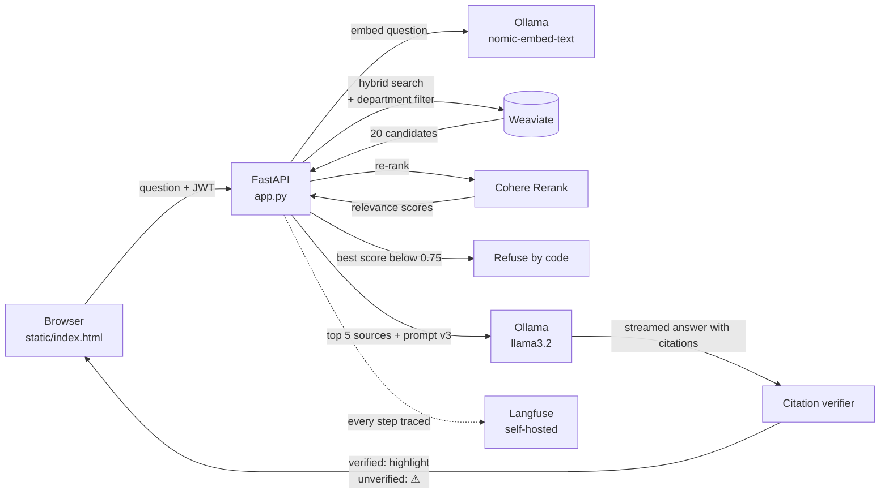

# Secure Enterprise RAG Bank Assistant


A retrieval-augmented generation (RAG) assistant that answers employee questions from real banking and employment documents, with **department-level access control**, **hybrid search with re-ranking**, **verifiable citations**, and **refusal by code** when the evidence is too weak.

Built in Python as Project 1 (and, below, Project 3) of an Applied AI Engineer portfolio roadmap. The language model, embeddings, vector database, and monitoring all run **locally**. The one external service is **Cohere Rerank** (free trial API), which receives the question and the retrieved passages. The source documents are public, but this matters for any private deployment.

## Beyond the roadmap: security features added

The roadmap asks for a RAG assistant with citations. Because this is a **bank** assistant, I added **access control** on top, which the roadmap does not require:

| Feature | What it does |
|---|---|
| **Login with tokens (JWT)** | Every question requires a signed, expiring session token. Passwords are stored as bcrypt hashes, never in plain text |
| **Admin approval** | New accounts start as *pending*; an admin approves them and assigns their department |
| **Department-based access (RBAC)** | Each document chunk is tagged with the departments allowed to see it. Search is filtered *inside the database query*, so an HR user can never receive Finance or Operations content |
| **Permission tests in the golden dataset** | 5 golden questions deliberately ask about other departments' documents; the report card fails if any forbidden source appears (**5/5 passing**), and the CI gate enforces it |

**Why:** in a real bank, an HR employee must not see confidential Finance or Operations documents, even through an AI assistant. Filtering at retrieval means the model never sees restricted text in the first place, so it cannot leak it.

---

## What it does

- **Answers questions from real documents** (UAE Labour Law, Basel Committee principles, FATF Recommendations)
- **Finds the right passages:** hybrid search (meaning + keywords) builds a candidate list, then Cohere Rerank keeps the best 5
- **Respects permissions:** each department only searches the documents it is allowed to read
- **Cites its sources:** every claim gets a numbered footnote; clicking it opens the source and highlights the supporting passage
- **Checks its own citations:** a verifier compares each claim with the cited passage, and flags weak or mismatched citations with ⚠ instead of trusting the model
- **Refuses when it doesn't know:** if no passage scores high enough, the code declines before the model is even called
- **Streams answers** word by word in the chat page

## Architecture



## Key engineering decisions (and the evidence behind them)

**Chunk size: ~600 tokens, sentence-aware, with overlap.**
Before choosing, I measured the documents (`inspect_pdfs.py`). The real documents average 400–570 tokens per page, so the roadmap's 500–800 token range fits. Chunks cross page breaks and record their page range. A `--preview` mode in `ingest.py` shows chunk sizes and overlap before anything is stored.

**From a vector-distance cut-off to hybrid search + re-ranking.**
The first version used vector search only, with a measured distance cut-off of 0.41 (`measure_distances.py`). Relevant and near-miss questions were only **0.022** apart, too narrow to be safe. Switching to **hybrid search + Cohere Rerank** and measuring again (`measure_rerank.py`) gave relevant questions **≥ 0.805** and irrelevant ones **≤ 0.675**, so the refusal line is now set at **0.75**, with a far wider safety margin.

**Top 5 sources (not 3).**
`debug_retrieval.py` showed the annual-leave entitlement clause ranked **4th**: found, but it would not have been sent to the model with a top-3 setting.

**Folder-based permissions.**
The folder a PDF sits in decides who can read it (`documents/HR/`, `documents/General/`...), replacing an earlier filename-guessing rule that could mis-tag files.

**Prompts in versioned config files.**
The answer prompt lives in `prompts/rag_answer.yaml` (currently **v3**), not in the code. Every answer, and every trace in Langfuse, is tagged with the prompt version.

## Evaluation: golden dataset and CI gate

- **50 golden questions** in `eval/questions.yaml`, in six categories: HR, general, finance, operations, **refusal** (questions the assistant must decline), and **security** (questions about other departments' documents).
- **`eval/run_eval.py`** asks all 50 through the real API and produces a **report card**: correct answers, citations verified, refusals, and permission checks.
- **CI gate (GitHub Actions):** the build fails if the latest committed report card is below **90% correct**, if any refusal question was answered, if any permission check leaked, or if any question errored.

## Other security hardening

- Project files are not served to the web (only `static/`)
- **JWT** authentication on every protected endpoint: identity comes from the token, never from the request body
- **CORS** restricted to known origins
- Source text rendered safely (escaped before display; no source text inside `onclick` attributes)

## Documents

The documents are public but copyrighted, so they are **not included** in this repository. Download them and place them in these folders:

| Folder | Document | Source |
|---|---|---|
| `documents/HR/` | UAE Federal Decree-Law No. 33 of 2021 (Labour Law) | https://uaelegislation.gov.ae/en/legislations/1541/download |
| `documents/Operations/` | BCBS: Revisions to the Principles for the Sound Management of Operational Risk (2021) | https://www.bis.org/bcbs/publ/d515.pdf |
| `documents/Finance/` | BCBS 239: Principles for effective risk data aggregation and risk reporting | https://www.bis.org/publ/bcbs239.pdf |
| `documents/General/` | The FATF Recommendations | https://www.fatf-gafi.org/en/publications/Fatfrecommendations/Fatf-recommendations.html |

## How to run

Requirements: Python 3.12+, Docker, [Ollama](https://ollama.com), and a free Cohere trial API key.

```bash
# 1. Start Weaviate
docker compose up -d

# 2. Get the local models
ollama pull nomic-embed-text
ollama pull llama3.2

# 3. Install Python packages
python -m venv venv
venv\Scripts\activate          # Windows (use: source venv/bin/activate on Mac/Linux)
pip install -r requirements.txt

# 4. Add your Cohere key to a .env file
#    COHERE_API_KEY=...

# 5. Add the documents (see table above), then preview and ingest
python ingest.py --preview
python ingest.py

# 6. Start the app, then open http://localhost:8000
python app.py
```

A default admin account (`admin` / `adminpassword`) is created on first run. **Change it before any real use.** Set a `JWT_SECRET` environment variable so sessions survive restarts.

## Tools included

| Script | Purpose |
|---|---|
| `inspect_pdfs.py` | Measure words and tokens per page before choosing a chunk size |
| `ingest.py` | Chunk, embed and store documents (`--preview` to inspect first) |
| `measure_distances.py` | Measure vector distances (used for the first, vector-only cut-off) |
| `measure_rerank.py` | Measure re-rank scores for relevant vs. irrelevant questions (sets the 0.75 line) |
| `debug_retrieval.py` | Show the top chunks for a question and where the answer ranked |
| `eval/run_eval.py` | Run the 50-question report card against the live API |

## Known limitations (honest list)

- **The small model sometimes cites the wrong source.** `llama3.2` (3B) often states the right fact but attaches the wrong footnote. The verifier catches many of these and marks them ⚠.
- **The citation verifier matches words, not meaning.** It was once fooled by an *article number* (the "30" in "Article (30) Maternity Leave" accepted as support for "30 days of annual leave"). Meaning-based scoring with Braintrust autoevals is in progress.
- **Slow on a CPU-only laptop:** a typical answer takes about a minute (see Project 3, Phase 2, below). Almost all of that time is the model, not the search.
- **Cohere's free trial has a rate limit;** the app waits and retries when it is hit.
- **Overlap averages ~45–55 tokens** rather than 100, because only whole sentences are carried over.
- **PDF noise:** repeated page headers and contents pages are embedded along with the real text.
- **The front end is plain HTML/JavaScript;** a React version is planned.

## Roadmap status (Project 1)

- [x] Ingestion, chunking, vector storage
- [x] Citations with highlighting and verification
- [x] Refusal by code with a measured cut-off
- [x] Hybrid search (vector + keyword) and Cohere re-ranking
- [x] Prompts in versioned config files
- [x] Golden dataset (50 questions), report card, and CI gate
- [x] Streaming answers
- [ ] Named evaluation scores (faithfulness, answer relevance) with Braintrust autoevals — in progress
- [ ] React front end with clickable citation viewer
- [x] **Beyond the roadmap:** login, admin approval, and department-based access control

## Project 3: Observability & Monitoring

> *Building the system is only 30% of the work; the remaining 70% is knowing whether it's actually working.*

This project upgrades the RAG assistant above into a **monitored** system: every question is traced step by step, and its speed, cost, and quality are measured over time.

### Phase 1: Full-stack tracing (Langfuse, self-hosted)

Every question is recorded in **Langfuse**, running locally in Docker, so traces (including the questions staff ask) never leave the machine. The Langfuse Python SDK is built on **OpenTelemetry**.

```
rag-query                       who asked, department, prompt version, outcome
├─ search
│   └─ retrieval                pages kept/dropped, relevance scores
│       └─ rerank               Cohere scores for every candidate, rate-limit warnings
├─ llm-answer   [generation]    model, prompt version, tokens in/out, time to first token, cost
└─ citation-check               citations, verified, unverified
```

- **Both endpoints are traced:** `/api/query` (used by the report card) and `/api/query/stream` (the chat page).
- **Streaming is traced by hand:** while streaming, the web server hands work between threads, so automatic trace context can get lost. The streaming steps are created explicitly and attached to the root trace.
- **Monitoring never breaks the product:** every tracing call in the streaming path goes through `trace_safely(...)`. If a tracing call fails, it prints a note and the answer continues.
- **Every trace is tagged with the prompt version** (`prompt-v3`), answering the SRE question *"which prompt version produced this?"*.

### Phase 2: Reliability metrics

Measured on the 50-question golden dataset plus chat usage, on a **CPU-only laptop** (no GPU).

#### Latency (from Langfuse)

| | P50 | P90 | P95 | P99 |
|---|---|---|---|---|
| **Whole question** (`rag-query`) | **59 s** | 1 min 29 s | **1 min 40 s** | 47 min 47 s* |
| AI answer (`llm-answer`) | 65 s | 1 min 30 s | 1 min 39 s | * |
| Search (`search`) | 1.1 s | 2.8 s | 2.9 s | |
| Re-rank (`rerank`, Cohere) | 1.0 s | 1.3 s | 1.7 s | |
| Citation check | 0.09 s | 0.23 s | 0.27 s | |

**Finding:** search, re-ranking, and the citation check take **1 to 3 seconds** together; the **AI model takes about a minute**. On this hardware, all meaningful speed gains are in the model step (fewer or shorter retrieved pages, or a GPU server), not in retrieval.

\* **The P99 is a single outlier:** one question during an unattended run, most likely frozen while the laptop slept. With about 60 traces, P99 is effectively the single worst question. This is exactly the kind of case an average hides and a percentile reveals.

#### Cost per request

Cost is calculated **from logged token counts**, using the per-token price in [`config/pricing.yaml`](config/pricing.yaml).

- The model runs locally, so its **actual cost is $0**. The configured price answers *"what would the same answers cost if this model were served by a hosted API?"*, using a published Llama 3.2 3B Instruct API price ($0.01 per million input tokens, $0.02 per million output tokens; source and date are in the config file).
- **About $0.00004 to $0.00007 per answered question**, which is roughly 15,000 to 25,000 questions per $1. Most tokens are **input** (the retrieved pages), not the answer itself.
- **Refused questions cost nothing**: the refusal happens in code, before the model is called.

#### Quality over time (Langfuse scores)

Every trace gets two scores:

| Score | Values | Result |
|---|---|---|
| `outcome` | answered / refused / failed / greeting | Gives the refusal and failure rates over time |
| `citation_coverage` | 0 to 1: the share of an answer's citations that were verified (an answer with no citations scores 0) | **Average 0.62** across 41 answers: 18 at 1.0, 10 at 0.0 |

The report card on the same run: **35/38 correct**, **6/6 refused correctly**, **5/5 permission checks**, and **62 of 83 citations verified (75%)**.

**Finding:** several **Finance and Operations** answers were correct but had **no citations at all**, so the reader cannot check them. This didn't show up in the "correct / incorrect" score, and only became visible through citation-coverage monitoring.

### Running the monitoring stack

```bash
# Langfuse (self-hosted), from its own folder
git clone https://github.com/langfuse/langfuse.git
cd langfuse
docker compose up -d          # then open http://localhost:3000, create a project and API keys
```

Add the keys to `.env`:

```
LANGFUSE_PUBLIC_KEY=pk-lf-...
LANGFUSE_SECRET_KEY=sk-lf-...
LANGFUSE_HOST=http://localhost:3000
```

Then start the app as usual (`python app.py`). Every question appears in Langfuse → **Tracing**.

### Phase 3: Regression gating

The 50-question golden dataset from Project 1 is now a **permanent gate**: if a change makes the assistant **more expensive** or **worse at citing its sources**, it is flagged in Langfuse and **CI fails**.

```
eval/questions.yaml ──build_tests.py──► regression/tests.yaml ──promptfoo──► regression/results/latest.json
 (one source of truth)                   (50 promptfoo tests)                          │
                                                                                       ▼
                                   regression/baseline.json ◄──compare──  check_regression.py
                                                                  │
                                       ┌──────────────────────────┴──────────────────────────┐
                               flagged in Langfuse                                fails CI (GitHub Actions)
                           ("regression-check" trace, ERROR)               (tests/test_regression_gate.py)
```

- **promptfoo** runs the golden questions against the live API through a small Python provider (`regression/provider.py`). It logs in as the right test user for each question, so department permissions are tested exactly as real users experience them, and it returns each answer with its **token usage**, **estimated cost**, and **citation counts**.
- **Tests are generated, not copied:** `regression/build_tests.py` turns `eval/questions.yaml` into promptfoo tests, so there is one source of truth. Checks: the key facts for normal questions, the refusal wording for out-of-scope questions, and **no forbidden sources** for permission questions. The permission check **fails safely**: if it cannot see the sources, the test fails rather than passing silently.
- **Prompts are versioned with the code** (`prompts/rag_answer.yaml`); every run and baseline records the prompt version.

#### Baseline (prompt v3, approved 8 October 2026)

| Measure | Baseline |
|---|---|
| Golden tests passed | **49 / 50** |
| Citation accuracy (verified / all citations, answered questions) | **76.5%** |
| Tokens per answered question | **2,332** |
| Estimated cost per answered question | **$0.0000242** |
| Permission failures | **0** |

The one failing test (`finance-number-of-principles`) is a **false refusal**: the fact is in BCBS 239, but no retrieved page cleared the 0.75 relevance bar, so the assistant declined. That is the safe failure mode (no wrong answer), and it is recorded as known in the baseline.

#### Gate rules

| Rule | Fails when |
|---|---|
| **Token cost** (roadmap) | Cost per answered question rises more than **10%** |
| **Citation accuracy** (roadmap) | Verified-citation rate drops more than **5 percentage points** |
| **Permissions** | Any permission test leaks a forbidden document |
| **Overall quality** | Fewer than **90%** of golden tests pass |

The tolerances exist because the model's answers vary slightly between runs; without them, the gate would fail on normal run-to-run wobble.

#### How a prompt change goes through the gate

1. Edit `prompts/rag_answer.yaml` and increase its `version`.
2. Run promptfoo (`npx promptfoo eval --no-cache -o results/latest.json` in `regression/`), then `python regression/check_regression.py`.
3. If the gate **fails**, Langfuse shows a red `regression-check` trace with the reasons, and CI will fail once the results are committed.
4. If the change is **intentional and better**, approve the new numbers: `python regression/check_regression.py --set-baseline`, and commit the new baseline with the prompt change.

#### How CI enforces it

`tests/test_regression_gate.py` runs on every push:
- **The real gate:** the committed `results/latest.json` must pass against `baseline.json`.
- **Fire drills:** fake runs prove the gate fails on a cost increase, a citation-accuracy drop, and a permission leak, and passes on a small normal cost wobble. These need no model, so they run in seconds.

**Honest limitation:** GitHub Actions cannot run the assistant itself (it needs Ollama, Weaviate, the documents, and API keys, and running a model in the cloud would cost money). So promptfoo runs **locally** against the real system (about 48 minutes for 50 questions on a CPU-only laptop), and CI gates the **committed results**. The same approach is used for the Project 1 report card.