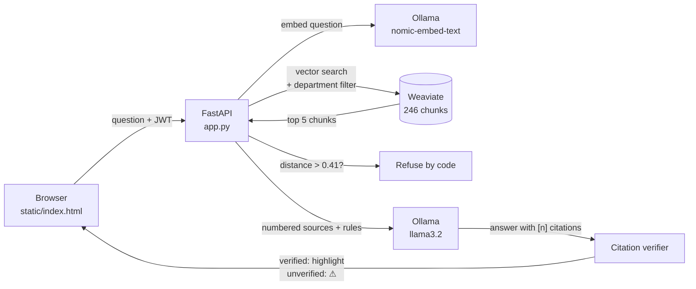

# Secure Enterprise RAG Bank Assistant


A retrieval-augmented generation (RAG) assistant that answers employee questions from real banking and employment documents, with **department-level access control**, **verifiable citations**, and **refusal by code** when the evidence is too weak.

Built in Python as Project 1 of an Applied AI Engineer portfolio roadmap. Everything runs locally: no document text leaves the machine.


---

## What it does

- **Answers questions from real documents** (UAE Labour Law, Basel Committee principles, FATF Recommendations)
- **Respects permissions:** each department only searches the documents it is allowed to read, enforced inside the database query
- **Cites its sources:** every claim gets a numbered footnote; clicking it opens the source and highlights the supporting passage
- **Checks its own citations:** a verifier compares each claim with the cited passage, and flags weak or mismatched citations with ⚠ instead of trusting the model
- **Refuses when it doesn't know:** if no retrieved passage is relevant enough, the code declines before the model is even called

## Architecture



## Key engineering decisions (and the evidence behind them)

**Chunk size: ~600 tokens, sentence-aware, with overlap.**
Before choosing, I measured the documents (`inspect_pdfs.py`). The real documents average 400–570 tokens per page, so the roadmap's 500–800 token range fits. Chunks cross page breaks and record their page range. A `--preview` mode in `ingest.py` shows chunk sizes and overlap before anything is stored.

**Relevance cut-off: 0.41 (cosine distance).**
Measured with `measure_distances.py` on relevant questions and bank-sounding "near-miss" questions:

| Questions | Closest distance |
|---|---|
| Relevant (8 questions) | 0.190 – 0.397 |
| Near-misses (e.g. "office dress code") | 0.419 – 0.433 |
| Unrelated (e.g. "capital of France") | 0.563 – 0.597 |

The gap is narrow (0.022), which is documented as a limitation. For a bank, a false refusal is cheaper than a false answer, so the line leans strict.

**Top 5 retrieval (not 3).**
`debug_retrieval.py` showed the annual-leave entitlement clause ranked **4th**: found, but not sent to the model. The chunk mixed the end of the previous article with the start of the leave article, so it looked "less about leave" than chunks that didn't contain the answer.

**Folder-based permissions.**
The folder a PDF sits in decides who can read it (`documents/HR/`, `documents/General/`...), replacing an earlier filename-guessing rule that could mis-tag files.

## Security

- Project files are not served to the web (only `static/`)
- Passwords hashed with **bcrypt**
- **JWT** authentication on every protected endpoint: identity comes from the token, never from the request body
- **CORS** restricted to known origins
- Source text rendered safely (escaped before display; no source text inside `onclick` attributes)

## Documents

The documents are public but copyrighted, so they are **not included** in this repository. Download them and place them in these folders:

| Folder | Document | Source |
|---|---|---|
| `documents/HR/` | UAE Federal Decree-Law No. 33 of 2021 (Labour Law) | https://uaelegislation.gov.ae/en/legislations/1541/download |
| `documents/Operations/` | BCBS: Revisions to the Principles for the Sound Management of Operational Risk (2021) | https://www.bis.org/bcbs/publ/d515.pdf |
| `documents/Finance/` | BCBS 239: Principles for effective risk data aggregation and risk reporting | https://www.bis.org/publ/bcbs239.pdf |
| `documents/General/` | The FATF Recommendations | https://www.fatf-gafi.org/en/publications/Fatfrecommendations/Fatf-recommendations.html |

## How to run

Requirements: Python 3.12+, Docker, and [Ollama](https://ollama.com).

```bash
# 1. Start Weaviate
docker compose up -d

# 2. Get the local models
ollama pull nomic-embed-text
ollama pull llama3.2

# 3. Install Python packages
python -m venv venv
venv\Scripts\activate          # Windows (use: source venv/bin/activate on Mac/Linux)
pip install -r requirements.txt

# 4. Add the documents (see table above), then preview and ingest
python ingest.py --preview
python ingest.py

# 5. Start the app, then open http://localhost:8000
python app.py
```

A default admin account (`admin` / `adminpassword`) is created on first run. **Change it before any real use.** Set a `JWT_SECRET` environment variable so sessions survive restarts.

## Tools included

| Script | Purpose |
|---|---|
| `inspect_pdfs.py` | Measure words and tokens per page before choosing a chunk size |
| `ingest.py` | Chunk, embed and store documents (`--preview` to inspect first) |
| `measure_distances.py` | Measure relevant vs. irrelevant distances to set the cut-off |
| `debug_retrieval.py` | Show the top 10 chunks for a question and where the answer ranked |

## Known limitations (honest list)

- **The small model sometimes cites the wrong source.** `llama3.2` (3B) often quotes the right fact but attaches the wrong footnote, or cites article numbers instead of source numbers.
- **The citation verifier matches words, not meaning.** It caught several wrong citations, but it was once fooled by an *article number*: the "30" in "Article (30) Maternity Leave" was accepted as support for "30 days of annual leave". Meaning-based checks are planned.
- **Narrow relevance gap.** Relevant and near-miss questions are only 0.022 apart; re-ranking is planned to widen it.
- **Overlap averages ~45–55 tokens** rather than 100, because only whole sentences are carried over.
- **PDF noise:** repeated page headers and contents pages are embedded along with the real text.
- Answers are not streamed yet, and the front end is plain HTML/JavaScript (a React version is planned).

## Roadmap status

- [x] Ingestion, chunking, vector storage
- [x] Citations with highlighting and verification
- [x] Refusal by code with a measured cut-off
- [ ] Hybrid search (vector + keyword) and re-ranking
- [ ] Prompts in versioned config files
- [ ] Evaluation: golden dataset, automated scoring, CI gate
- [ ] Streaming answers and a React front end

---

## Project 3: Observability & Monitoring

> *Building the system is only 30% of the work; the remaining 70% is knowing whether it's actually working.*

This project upgrades the RAG assistant above into a **monitored** system: every question is traced step by step, and its speed, cost, and quality are measured over time.

### Phase 1: Full-stack tracing (Langfuse, self-hosted)

Every question is recorded in **Langfuse**, running locally in Docker, so traces (including the questions staff ask) never leave the machine. The Langfuse Python SDK is built on **OpenTelemetry**.

```
rag-query                       who asked, department, prompt version, outcome
├─ search
│   └─ retrieval                pages kept/dropped, relevance scores
│       └─ rerank               Cohere scores for every candidate, rate-limit warnings
├─ llm-answer   [generation]    model, prompt version, tokens in/out, time to first token, cost
└─ citation-check               citations, verified, unverified
```

- **Both endpoints are traced:** `/api/query` (used by the report card) and `/api/query/stream` (the chat page).
- **Streaming is traced by hand:** while streaming, the web server hands work between threads, so automatic trace context can get lost. The streaming steps are created explicitly and attached to the root trace.
- **Monitoring never breaks the product:** every tracing call in the streaming path goes through `trace_safely(...)`. If a tracing call fails, it prints a note and the answer continues.
- **Every trace is tagged with the prompt version** (`prompt-v3`), answering the SRE question *"which prompt version produced this?"*.

### Phase 2: Reliability metrics

Measured on the 50-question golden dataset plus chat usage, on a **CPU-only laptop** (no GPU).

#### Latency (from Langfuse)

| | P50 | P90 | P95 | P99 |
|---|---|---|---|---|
| **Whole question** (`rag-query`) | **59 s** | 1 min 29 s | **1 min 40 s** | 47 min 47 s* |
| AI answer (`llm-answer`) | 65 s | 1 min 30 s | 1 min 39 s | * |
| Search (`search`) | 1.1 s | 2.8 s | 2.9 s | |
| Re-rank (`rerank`, Cohere) | 1.0 s | 1.3 s | 1.7 s | |
| Citation check | 0.09 s | 0.23 s | 0.27 s | |

**Finding:** search, re-ranking, and the citation check take **1 to 3 seconds** together; the **AI model takes about a minute**. On this hardware, all meaningful speed gains are in the model step (fewer or shorter retrieved pages, or a GPU server), not in retrieval.

\* **The P99 is a single outlier:** one question during an unattended run, most likely frozen while the laptop slept. With about 60 traces, P99 is effectively the single worst question. This is exactly the kind of case an average hides and a percentile reveals.

#### Cost per request

Cost is calculated **from logged token counts**, using the per-token price in [`config/pricing.yaml`](config/pricing.yaml).

- The model runs locally, so its **actual cost is $0**. The configured price answers *"what would the same answers cost if this model were served by a hosted API?"*, using a published Llama 3.2 3B Instruct API price ($0.01 per million input tokens, $0.02 per million output tokens; source and date are in the config file).
- **About $0.00004 to $0.00007 per answered question**, which is roughly 15,000 to 25,000 questions per $1. Most tokens are **input** (the retrieved pages), not the answer itself.
- **Refused questions cost nothing**: the refusal happens in code, before the model is called.

#### Quality over time (Langfuse scores)

Every trace gets two scores:

| Score | Values | Result |
|---|---|---|
| `outcome` | answered / refused / failed / greeting | Gives the refusal and failure rates over time |
| `citation_coverage` | 0 to 1: the share of an answer's citations that were verified (an answer with no citations scores 0) | **Average 0.62** across 41 answers: 18 at 1.0, 10 at 0.0 |

The report card on the same run: **35/38 correct**, **6/6 refused correctly**, **5/5 permission checks**, and **62 of 83 citations verified (75%)**.

**Finding:** several **Finance and Operations** answers were correct but had **no citations at all**, so the reader cannot check them. This didn't show up in the "correct / incorrect" score, and only became visible through citation-coverage monitoring.

### Running the monitoring stack

```bash
# Langfuse (self-hosted), from its own folder
git clone https://github.com/langfuse/langfuse.git
cd langfuse
docker compose up -d          # then open http://localhost:3000, create a project and API keys
```

Add the keys to `.env`:

```
LANGFUSE_PUBLIC_KEY=pk-lf-...
LANGFUSE_SECRET_KEY=sk-lf-...
LANGFUSE_HOST=http://localhost:3000
```

Then start the app as usual (`python app.py`). Every question appears in Langfuse → **Tracing**.

### Phase 3: Regression gating

*Coming next: if a new prompt increases token cost or decreases citation accuracy, it is flagged and CI fails.*